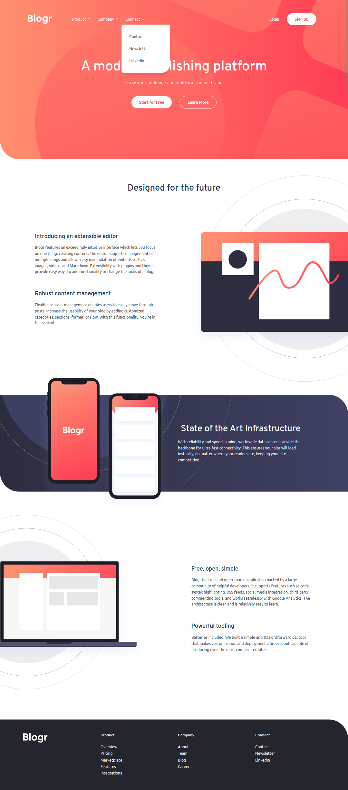
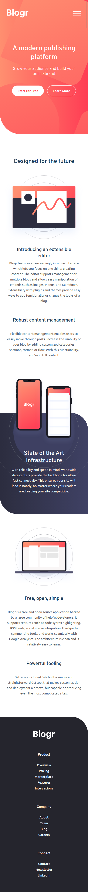
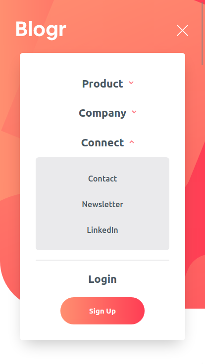

# Frontend Mentor - Blogr landing page solution

This is a solution to the [Blogr landing page challenge on Frontend Mentor](https://www.frontendmentor.io/challenges/blogr-landing-page-EX2RLAApP). Frontend Mentor challenges help you improve your coding skills by building realistic projects.

## Table of contents

- [Overview](#overview)
  - [The challenge](#the-challenge)
  - [Screenshot](#screenshot)
  - [Links](#links)
- [My process](#my-process)
  - [Built with](#built-with)
  - [What I learned](#what-i-learned)
  - [Continued development](#continued-development)
  - [Useful resources](#useful-resources)
- [Author](#author)

## Overview

### The challenge

Users should be able to:

- View the optimal layout for the site depending on their device's screen size
- See hover states for all interactive elements on the page

### Screenshot





### Links

- Solution URL: [Github URL here](https://github.com/atorres-io/frontend-mentor-blogr-lading-page)
- Live Site URL: [Live Site URL here](https://naughty-lumiere-249dfd.netlify.app/)

## My process

### Built with

- Semantic HTML5 markup
- CSS custom properties
- Flexbox
- BEM methodology
- ITCSS architecture
- Vanilla JavaScript (ES6)

### What I learned

```js
window.requestAnimationFrame(() => {
	//inform the browser that you want to make an animation.
});
```

### Continued development

I want to improve the animation of icons and illustrations, scroll page animations, adaptation to all available screens...

### Useful resources

- [requestAnimationFrame](https://developer.mozilla.org/es/docs/Web/API/Window/requestAnimationFrame) - Thanks to this you can use transitions even if you play with display property of css from js.

## Author

- Instagram - [@atorres.designs](https://www.instagram.com/atorres.designs/)
- Frontend Mentor - [@atorres-io](https://www.frontendmentor.io/profile/atorres-io)
- Github - [/atorres-io](https://github.com/atorres-io)
- Codepen - [/atorres-designs](https://codepen.io/atorres-designs)
- LinkedIn - [/atorresalcala](https://www.linkedin.com/in/atorresalcala)
